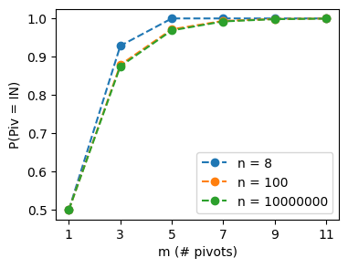
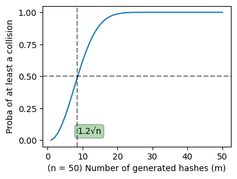
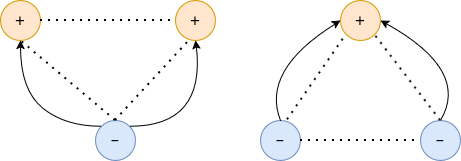
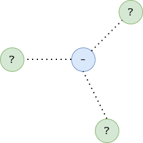
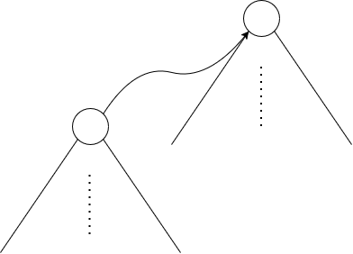

# Laborator 03: Algoritmi aleatori

De multe ori, un algoritm corect cu o complexitate bună este relativ greu de implementat. Alteori, putem avea dificultăți majore în stabilirea unei clase de complexitate adecvate algoritmului nostru. O alternativă des întâlnită în practică este introducerea aspectului aleator în algoritmii noștri, fapt ce ne poate aduce o implementare mai ușoară sau o demonstrație mai simplă pentru complexitate.

Totuși, aceste avantaje nu sunt gratuite: ori nu putem garanta corectitudinea răspunsului nostru, ci doar că răspunsul adevărat se află într-un interval cu o probabilitate mare (c.p.m.), sau că răspunsul nostru este corect c.p.m. - *algoritmi Monte Carlo*, sau nu putem garanta că programul nostru este într-o anumită clasă de complexitate, ci doar o respectă în cazul mediu, sau este în aceasta c.p.m. - *algoritmi Las Vegas*.


### Quicksort și Quickselect

Posibil cel mai cunoscut algoritm de tip Las Vegas este quicksort, care sortează un vector în timp mediu $O(n \log n)$, optim pentru sortări prin comparații. Vom vedea în continuare de ce complexitatea în cel mai rău caz $O(n^2)$ nu este un impediment. Deoarece sortează in-place și lucrează doar cu elemente ce încap în cache începând cu o adâncime relativ mică, quicksort este folosit ca primul din cei trei algoritmi în `introsort`, algoritmul din spatele `std::sort` pentru anumite versiuni ale bibliotecii standard.

Analogul lui este quickselect. Acesta poate răspunde în timp mediu $O(n)$ ce valoare ar fi pe a $k$-a poziție dacă vectorul ar fi sortat (`std::nth_element`).

Mai jos vom calcula complexitatea medie a quicksort și vom arăta că respectă clasa de complexitate $O(n \log n)$ cu probabilitate mare (în literatură cu probabilitate mare înseamnă orice $1 - o(1)$, e.g. $1 - O(1/n)$; în cazul quicksort vom arăta $1 - n^{-2}$). Întâi vom descrie o variantă non-inplace a lui qsort ca referință:

```py
def qsort(v):
    p = random.choice(v) # alegere valoare pivot
    return v if len(v) <= 1 else
        qsort([x for x in v if x < p]) +
        [x for x in v if x == p] +
        qsort([x for x in v if x > p])
```

Fie $T(n)$ o variabilă aleatoare care descrie numărul de pași pe care îl facem când sortăm un vector de lungime $n$. Vrem să arătăm că valoarea medie $E(T(n)) \in O(n \log n)$.

Când alegem un pivot la întâmplare, avem o șansă de $1/2$ ca acesta să fie în intervalul $[1/4, 3/4]$ dacă vectorul este sortat. Fie o variabilă aleatoare $\text{Piv} \in \{\text{IN}, \text{OUT}\}$ care descrie dacă un pivot ales pică în $[1/4, 3/4]$: $P(\text{Piv} = \text{IN}) = 1/2$.

$$E(T(n)) = O(n) + P(\text{Piv} = \text{IN}) \cdot E(T(n) \mid \text{Piv} = \text{IN}) + P(\text{Piv} = \text{OUT}) \cdot E(T(n) \mid \text{Piv} = \text{OUT})$$

Unde $O(n)$ este datorat aducerii pivotului pe poziția lui corectă și a oricărui element mai mic/mare decât el la stânga/dreapta lui. Dar:

$$E(T(n) \mid \text{Piv} = \text{IN}) \leq \max_{n/4 \leq k \leq n/2} E(T(k)) + E(T(n-k)) = E(T(n/4)) + E(T(3n/4))$$

Observați că algoritmul nostru sortează prin comparare, deci are complexitatea $\Omega(n \log n) \in \Omega(n)$ și astfel maximul de mai sus se atinge cu cât diferența absolută între argumente este cât mai mare.

Analog:

$$E(T(n) \mid \text{Piv} = \text{OUT}) \leq \max_{1 \leq k \leq n/4} E(T(k)) + E(T(n-k)) = E(T(1)) + E(T(n-1)) = 0 + E(T(n-1)) \leq E(T(n))$$

Astfel:

$$E(T(n)) \leq O(n) + \frac{1}{2} (E(T(n/4)) + E(T(3n/4))) + \frac{1}{2}E(T(n)) \Rightarrow E(T(n)) \leq O(n) + E(T(n/4)) + E(T(3n/4))$$

În continuare vom expanda membrul drept:

$$E(T(n)) \leq cn + E(T(n/4)) + E(T(3n/4)) \leq cn \Bigl(1 + \frac{1}{4} + \frac{3}{4} \Bigr) + E(T \Bigl( \Bigl(\frac{1}{4}\Bigr)^2 n\Bigr)) + 2E(T \Bigl(\frac{1}{4}\frac{3}{4}n\Bigr)) + E(T \Bigl(\frac{3}{4}\Bigr)^2 n)$$

Putem observa că coeficienții pentru $E(T(.))$ sunt din triunghiul lui Pascal. După $k$ expandări:

$$E(T(n)) \leq k \cdot cn + \sum_{i=0}^k \text{C}_k^i   E( T \Bigl( \Bigl(\frac{1}{4}\Bigr)^{k-i} \Bigl(\frac{3}{4}\Bigr)^i n \Bigr) )$$

Pentru $k = \log_{4/3}n$, $n   3^i/4^i \cdot 1/4^{k-i} = n 3^i/4^k \leq 1    \forall   0 \leq i \leq k$ și atunci:

$$E(T(n)) \leq k cn + \sum_{i=0}^k \text{C}_k^i   E(T(1)) = kcn + 2^k \in O(n \log n + n) \Rightarrow E(T(n)) \in O(n \log n)$$

Ce se schimbă atunci când alegem mediana dintre $m > 1$ pivoți aleatori? Presupunem că selectăm mediana în $O(m^2)$.


<figure>
    <p align="center"></p>
    <figcaption>Vrem să calculăm probabilitatea ca pivotul median sa fie în primul sfert. Dacă m = 3, atunci minim doi dintre pivoți trebuie să fie în primul sfert.</figcaption>
</figure>


$$P(\text{Piv} = \text{OUT}) = 2 \cdot \frac{\text{C}_{n/4}^3 + \text{C}_{n/4}^2 \frac{3n}{4} \frac{1}{3}}{\text{C}_{n}^3} = 2 \cdot \frac{\text{C}_{n/4}^2 \Bigl(\frac{n}{4} - 2\Bigr) \frac{1}{3} + \text{C}_{n/4}^2 \frac{3n}{4} \frac{1}{3}}{\text{C}_{n}^3} = 2 \cdot \frac{\text{C}_{n/4}^2}{\text{C}_{n}^2}$$

Putem generaliza peste $m$ și obținem:

$$P(\text{Piv} = \text{IN}) = 1 - 2 \cdot \frac{\text{C}_{n/4}^{(m+1)/2}}{\text{C}_{n}^{(m+1)/2}} =^\text{not} p(n, m)$$


| $m$   | $p(10^2, m)$   | $p(10^7, m)$   | $\lim_{n \rightarrow +\infty} p(n, m) =^\text{not} p(m)$   |
|-------|----------------|----------------|------------------------------------------------------------|
| $1$   | $0.5$          | $0.5$          | $1/2$                                                      |
| $3$   | $0.878$        | $0.875$        | $7/8$                                                      |
| $5$   | $0.971$        | $0.968$        | $31/32$                                                    |
| $7$   | $0.993$        | $0.992$        | $127/128$                                                  |
| $9$   | $0.998$        | $0.998$        | $511/512$                                                  |
| $11$  | $0.999$        | $0.999$        | $2047/2048$                                                |


<figure>
    <p align="center"></p>
</figure>

Probabilitatea de a avea pivotul median înăuntrul intervalului $[1/4, 3/4]$ crește rapid spre $1$. Probabilitatea scade foarte puțin cu creșterea lui $n$. În practică este folosit $m \leq 3$.

Cât despre valoarea medie a complexității, partea recursivă nu se schimbă în funcție de $m$.

$$E(T(n)) \leq O(n + m^2) + p(m)(E(T(n/4)) + E(T(3n/4))) + (1-p(m))E(T(n))$$

Ceea ce conduce la aceeași concluzie.

În continuare vom vedea cât de des respectă quicksort complexitatea pe care o are în medie. Vom demonstra că există o constantă $c(m)$ ce nu depinde de lungimea vectorului $n$, ci doar de numărul de pivoți $m$ astfel încât:

$$P(\text{\\# op qsort} > c(m) n \ln n) < \frac{1}{n^2}$$

**Observație**: putem construi din vector un arbore binar de pivoți, unde rădăcina este primul pivot ales, iar cei doi copii sunt pivoții aleși de apelurile recursive (dacă acestea există). Fie $d(x) \geq 1$ o variabilă aleatoare ce descrie adâncimea nodului $x$ în arborele de pivoți. Atunci nodul $x$ contribuie la numărul de pași ai lui quicksort proporțional cu $d(x)$.

<details>
<summary>Spoiler: calcul</summary>

Pentru un nod specific $x$, fie alte variabile aleatoare $Y_1, Y_2, \ldots Y_{d(x)} \in \{0, 1\}$, unde $Y_i = 1$ înseamnă că a $i$-a pivotare ce-l privește pe $x$ a avut $\text{Piv} = \text{IN}$. Vom calcula un majorant pentru $P(d(x) \geq c(m) \ln n)$.

Dacă $d(x) \geq c(m) \ln n$, atunci intervalul corespunzător lui $x$ după $c(m) \ln n$ pivotări este $\geq 1$. Notăm $s_x = \sum_{i=1}^{c(m) \ln n}Y_i$.

$$d(x) \geq c(m) \ln n \Rightarrow \Bigl(\frac{3}{4}\Bigr)^{s_x}n \geq 1$$

E.g. dacă luăm în considerare împărțirile cu $\text{Piv} = \text{IN}$ din primele $c(m) \ln n$ (unde IN reduce la $3/4$ lungimea intervalului și OUT o păstrează), nu reușim să scădem intervalul asociat sub $1$ (i.e. avem nevoie și de restul împărțirilor până la adâncime $d(x)$ pentru a ajunge sub $1$).

$$\Bigl(\frac{3}{4}\Bigr)^{s_x}n \geq 1 \Rightarrow s_x(\ln 3 - \ln 4) \leq -\ln n \Rightarrow s_x \geq \frac{\ln n}{\ln 4 - \ln 3}$$

Acum putem reveni la $P(d(x) \geq c(m) \ln n)$:

$$P(d(x) \geq c(m) \ln n) \leq P(s_x \leq \frac{\ln n}{\ln 4 - \ln 3}) \leq P(s_x \leq 3.5 \ln n) = P(\sum_{i=1}^{c(m) \ln n}Y_i \leq 3.5 \ln n)$$

Cum $Y_i$ este o variabilă Bernoulli și lucrăm cu o sumă de asemenea variabile (independente), putem aplica una dintre inegalitățile lui Chernoff pentru a majora probabilitatea ca suma variabilelor $Y_i$ să fie cu mult sub media lor:

$$P(\sum_i Y_i \leq (1 - \delta)\mu) \leq e^{-\mu \delta^2/2}$$

Unde $\mu = E(\sum_i Y_i)$, iar $0 < \delta < 1$ îl putem alege noi.

$$\mu = E(\sum_{i=1}^{c(m) \ln n} Y_i) = c(m) \ln n \cdot P(\text{Piv} = \text{IN}) = c(m) \ln n \cdot p(m)$$

Vrem $(1 - \delta) \mu = 3.5 \ln n \Rightarrow (1 - \delta) c(m) \ln n \cdot p(m) = 3.5 \ln n$. Alegem $\delta = 1 - 7 / (2p \cdot c(m))$ (eventual va trebui să ne întoarcem aici și să verificăm $\delta > 0$).

$$P(\sum_{i=1}^{c(m) \ln n} Y_i \leq 3.5 \ln n) \leq e^{-c(m)\ln n \cdot p(m) \cdot \delta^2/2} = n ^ {-c(m)p(m) \cdot \delta^2/2}$$

Vrem ca $P(\sum_{i=1}^{c(m) \ln n} Y_i \leq 3.5 \ln n) < n^{-3}$, deci vrem ca exponentul de mai sus:

$$-c(m)p(m) \cdot \delta^2/2 \leq -3 \iff c(m)p(m) \cdot \Bigl(1 - \frac{7}{2p(m) \cdot c(m)}\Bigr)^2 \geq 6$$

Dacă rezolvăm ecuația de gradul doi obținem $p(m)c(m) \leq (13 - 2\sqrt{30})/2$ (dar nu putem folosi intervalul, deoarece ar însemna $\delta < -2.4 < 0$) și $p(m)c(m) \geq (13 + 2\sqrt{30})/2$. Astfel, cea mai mică constantă $c(m)$ pe care o putem folosi este:

$$c(m) = \frac{13 + 2\sqrt{30}}{2p(m)} \geq \frac{13 + 2\sqrt{30}}{2p(n, m)} \\,\\, \forall \\, n$$

Ultima inegalitate este adevărată pentru că $p(n, m)$ tinde descrescător la $p(m)$. Observați că ne-am îndeplinit obiectivul inițial, $c(m)$ ales depinde doar de $p(m)$, independent de $n$.

</details>

Refolosim tabelul cu valorile lui $p(m)$:


| $m$   | $p(m)$   | $\text{ceil}(c(m))$ |
|-------|----------|---------------------|
| $1$   | $0.5$    | $24$                |
| $3$   | $0.875$  | $14$                |
| $5$   | $0.968$  | $13$                |
| $7$   | $0.992$  | $13$                |
| $9$   | $0.998$  | $13$                |
| $11$  | $0.999$  | $12$                |


Deci creșterea numărului de pivoți scade adâncimea maximă a arborelui de pivoți pe care o putem întâlni în practică (cu probabilitate mare). Totuși, atingem "diminishing returns" după $m = 3$.

Reiterăm rezultatul obținut:

$$P(d(x) \geq c(m) \ln n) \leq P(\sum_{i=1}^{c(m) \ln n} Y_i \leq 3.5 \ln n) \leq n^{-3}$$

Pentru a termina demonstrația, vom limita adâncimea maximă a arborelui de pivoți la $c(m) \ln n$. Folosim inegalitatea lui Boole (Union Bound) pentru a majora probabilitatea ca oricare nod $x$ să aibă adâncimea peste $c(m) \ln n$:

$$P(\bigcup_{x \in \text{Nodes}} d(x) \geq c(m) \ln n) \\,\\,\\,\leq\\,\\,\\, n \cdot P(d(x) \geq c(m) \ln n) \leq n \cdot n^{-3} = n^{-2}$$

Dacă orice adâncime $d(x) < c(m) \ln n \Rightarrow \\#$ qsort ops $= O(\sum_x d(x)) \in O(n \cdot c(m) \ln n) = O(n \ln n)$:

$$1 - n^{-2} < P(\bigcap_{x \in \text{Nodes}} d(x) < c(m) \ln n) \\,\\,\\,\leq\\,\\,\\, P(\\# \text{qsort ops} \in O(n \ln n))$$

Prima inegalitate se obține prin complementarea uniunii de dinainte: $P(\cup) \leq n^{-2} \Rightarrow P(\cap) > 1 - n^{-2}$. A doua inegalitate folosește proprietatea că dacă avem două evenimente $A \Rightarrow B$, atunci $P(A) \leq P(B)$.


### Aplicații Quicksort și Quickselect

1. Implementați quicksort non-inplace (varianta prezentată aici) și varianta inplace. Comparați timpii de rulare relativ la un algoritm din biblioteca standard, e.g. `std::sort`. Variați $m$. Vedeți `applications.ipynb`.
2. Creați un plot cu adâncimea maximă a unui arbore pivot peste mai multe valori ale lui $m$. Creați o histogramă cu adâncimea maximă pentru un $m$ specific. Estimați probabilitatea ca adâncimea să depășească $c(m) \ln n$ (Monte Carlo) și comparați-o cu cea obținută teoretic, i.e. $n^{-2}$. Vedeți `applications.ipynb`.
3. De ce vrem ca $\text{PIV} = \text{IN}$ să însemne că pivotul pică în $[1/4, 3/4]$? De ce nu în alt interval egal cu jumătatea lungimii vectorului, e.g. $[0, 1/2]$?
4. **Bonus**: Refaceți calculele pentru quickselect pentru complexitatea medie și probabilitatea ca algoritmul să respecte clasa de complexitate medie. Folosiți $m = 1$. **Bonus**$^2$: lăsați $m$ ca variabilă.


### Bonus: Treap-uri

<details>
<summary>Spoiler: conținut</summary>

Treap-ul este un Arbore Binar de Comparare în care fiecare nod $x$ are o prioritate $\text{prio}(x)$, iar prioritățile respectă proprietatea de max-heap. Este posibil ca inserarea unui nod nou să modifice structura arborelui pentru a păstra invariantul de max-heap. Schimbarea formei treap-ului poate face dificil calculul timpului mediu de inserție al unui nod sau adâncimea maximă în medie a treap-ului.

**Proprietate**: dacă știm prioritățile nodurilor dinainte de orice inserare, forma finală a treap-ului este unică, predeterminată și indiferentă de ordinea inserărilor.

Rădăcina treap-ului va fi ocupată de nodul cu prioritatea maximă. În subarborele stâng vor fi toate nodurile cu valoare mai mică, iar în dreapta toate cu valoare mai mare. Repetăm recursiv ocuparea celor doi copii ai rădăcinii. Presupunând că prioritățile sunt trase dintr-o distribuție uniformă:

$$P(x \text{ ales ca rădăcină}) = P(\text{prio}(x) = \max_{y}\text{prio}(y)) = \frac{1}{n} = P(x \text{ ales ca pivot pentru qsort când } m = 1)$$

Deci treap-ul este echivalent cu un arbore de pivoți cu $m = 1$. Deși quicksort își poate regula probabilitatea de a alege un pivot "bun" prin creșterea lui $m$, treap-ul nu poate face acest lucru doar prin priorități; are nevoie și de cunoașterea valorilor.

Astfel adâncimea medie a unui nod în treap este $O(\log n)$ și probabilitatea ca un nod din treap să aibă adâncimea finală mai mare de $24 \ln n$ este mai mică decât $n^{-2}$.


### Aplicații treap-uri

1. **Bonus**: puteți vedea o altă demonstrație [aici](https://www.cs.cmu.edu/afs/cs/academic/class/15210-s12/www/lectures/lecture16.pdf).

</details>


### Hashuri polinomiale. Birthday paradox

Hashurile polinomiale sunt posibil cea mai ușoară variantă de a obține algoritmi de complexitate subpatratică pe probleme cu string-uri. Fie un alfabet $\Sigma$ și o funcție de conversie $\text{cv}: \Sigma \rightarrow \{0, \ldots, B-1\}$ care transformă orice simbol din alfabet într-un număr. Atunci hash-ul polinomial $H : \Sigma^* \rightarrow \mathbb{N}$ al unui string $s$ este:

$$H(s) = \sum_{i=0}^{|s|-1} B^{|s|-1-i} \text{cv}(s_i)$$

În loc să comparăm string-uri, alegem să calculăm hash-urile string-urilor ca mai apoi să comparăm hash-urile între ele. Totuși, dacă nu compresăm într-un fel numărul ținut minte de hash, vom fi obligați să folosim o structură tip `BigInt`, iar complexitatea comparației va rămâne proporțională în lungimea stringurilor. Un avantaj al arhitecturilor pe care le folosim este că numerele ce pot fi reprezentate până într-un număr fix de biți pot fi comparate într-un ciclu de ceas. Astfel, alegem să compresăm distructiv hash-urile aplicând un modulo $M$.

În practică, baza $B$ și modulo-ul $M$ sunt alese astfel încât $(B, M) = 1$. $M$ este fix și $B$ este ales aleator din $(|\Sigma|, M)$. Intervalul este deschis și la stânga pentru că de obicei nu vrem pentru niciun caracter $a$ să avem $\text{cv}(a) = 0$. Dacă vrem să scădem probabilitatea de coliziune între două hash-uri, putem alege mai multe baze aleatoare.

Probabilitatea ca hash-urile generate de noi să rezulte într-o coliziune este dependentă de context (simbolurile din string-uri). Știm totuși că $H$ este cel mult la fel de bun ca funcția de hash perfectă $H^* : X \rightarrow Y$, unde $|Y| = n$, iar:

$$\lim_{k \rightarrow +\infty} \frac{\sum_{i=1}^{k} {\bf 1}(H^*(s_i) = y)}{k} = \frac{1}{n} \\,\\,\forall\\, y \in Y$$

E.g. funcția de hash perfectă $H^\*$ nu favorizează niciun slot de ieșire $y$ în defavoarea altora. În plus, $H^\*$ este independentă de context și putem selecta doar $(B, M)$ care se comportă bine pe $H^\*$.

Probabilitatea să nu avem nicio coliziune dacă generăm hash-uri $H^\*$ pentru $m$ string-uri distincte este:

$$P(\nexists \text{ coliziune}) = \frac{A_{n}^{m}}{n^m} = \frac{n!}{(n-m)!n^m}$$

<figure>
    <p align="center"></p>
    <figcaption>Graficul pentru complementul probabilității de mai sus.</figcaption>
</figure>

Să încercăm să aproximăm $m$ pentru care $P(\nexists) = 1/2$:

$$P(\nexists) = \frac{A_{n}^{m}}{n^m} = \frac{n!}{(n-m)!n^m} = \prod_{i=0}^{m-1} \Bigl(1 - \frac{i}{n}\Bigr)$$

Dar $(1 - 1/n)^2 = 1 + 1/n^2 - 2/n$, unde putem aproxima $1/n^2 \simeq 0$ dacă $n$ este îndeajuns de mare, deci $(1 - 1/n)^2 \simeq 1 - 2/n$. Analog putem folosi $(1 - 1/n)^i \simeq 1 - i/n$:

$$P(\nexists) = \frac{A_{n}^{m}}{n^m} \simeq \Bigl(1 - \frac{1}{n}\Bigr)^{0 + 1 + \ldots + m-1} = \Bigl(1 - \frac{1}{n}\Bigr)^{\text{C}_m^2}$$

Dar $(1 - 1/n)^n \simeq e^{-1}$ pentru $n$ mare:

$$P(\nexists) = \frac{1}{2} = e^{- \ln 2} \simeq e^{-\frac{\text{C}_m^2}{n}} \Rightarrow \text{C}_m^2 \simeq n \ln 2 \Rightarrow m \simeq \sqrt{n \cdot 2 \ln 2} \simeq 1.2 \sqrt{n}$$

Deci regula de bază dacă generăm $m$ hash-uri este să alegem un modulo $M$ astfel încât $m << 1.2\sqrt{M}$.

De fapt, acesta este și paradoxul zilei de naștere, dacă sunt $M$ zile într-un an, avem nevoie doar de $\sim 1.2\sqrt{M}$ oameni pentru a avea o probabilitate bună ca cel puțin doi dintre ei să-și împartă ziua de naștere.

Observație: dacă avem un algoritm care face $k$ comparații între hash-uri, $P(\nexists) \simeq (1 - 1/n)^k$. Sortarea unui vector de $m$ hash-uri presupune $\text{C}_m^2$ comparații, chiar dacă algoritmi mai eficienți fac majoritatea acestor comparații implicit!

Întorcându-ne la hash-urile polinomiale, acestea sunt întâlnite des în practică pentru că ne permit calculul în $O(1)$ al lui $H(s[1 .. k])$ dacă știm valoarea lui $H(s[0 .. k-1])$:

$$H(s[0 .. k-1]) \equiv \sum_{i=0}^{k-1} B^{k-1-i} \text{cv}(s_i) \equiv B^{k-1} \text{cv}(s_0) + \textcolor{red}{\sum_{i=1}^{k-1} B^{k-1-i} \text{cv}(s_i)} \\,\\,\\,(\text{mod } M)$$

$$H(s[1 .. k]) \equiv \sum_{i=1}^{k} B^{k-1-(i-1)} \text{cv}(s_i) \equiv \sum_{i=1}^{k-1} B^{k-1-(i-1)} \text{cv}(s_i) + \text{cv}(s_k) \equiv B\textcolor{red}{\sum_{i=1}^{k-1} B^{k-1-i} \text{cv}(s_i)} + \text{cv}(s_k) \\,\\,\\,(\text{mod } M)$$

$$\Rightarrow H(s[1 .. k]) \equiv B \cdot \textcolor{red}{(H(s[0 .. k-1]) - B^{k-1} \text{cv}(s_0))} + \text{cv}(s_k) \\,\\,\\,(\text{mod } M)$$


### Aplicații Hashuri polinomiale. Birthday paradox

1. Alegeți o bază $B$ și un modulo $M$ cu $(B, M) \neq 1$. Găsiți un neajuns cu această alegere. Hint: calculați puterile $B^i$ și vedeți cât de repede încep să se repete.
2. De ce nu vrem în general pentru niciun caracter $a$ să avem $\text{cv}(a) = 0$? Hint: încercați să comparați string-uri de lungimi diferite. Încercați să găsiți un exemplu simplu pentru care obțineți o coliziune.
3. Rezolvați [CSES 1753](https://cses.fi/problemset/task/1753). Câte comparații între hash-uri face algoritmul vostru? Estimați $P(\nexists)$.
4. Câte subsecvențe distincte de lungime $k$ există într-un string $s$? Câte comparații între hash-uri face algoritmul vostru? Estimați $P(\nexists)$. Implementați cel puțin încă o rezolvare a problemei care sa fie deterministă, e.g. inserări într-un trie sau sortări peste subsecvențele de lungime $k$ cu un comparator custom. Comparați viteza și corectitudinea soluției deterministe cu cea Monte-Carlo. Vedeți `applications.ipynb`.
5. **Bonus**: presupunem că incercăm să scădem probabilitatea de coliziune între două hash-uri cu o singură bază și două modulo-uri $M_1, M_2$. Am putea presupune că avem nevoie de generarea a $O(\sqrt{M_1M_2})$ hash-uri în medie pentru a găsi o coliziune cu Birthday Attack. Scrieți un algoritm care vă permite să găsiți o coliziune în medie după generarea a doar $O(\sqrt{M_1} + \sqrt{M_2})$ hash-uri (Composed Birthday Attack). **Bonus**$^2$: generalizați la $k$ modulo-uri în loc de două. Există vreo problemă cu lungimea hash-urilor găsite?


### Determinarea componentelor conexe în paralel: Reif Random-Mate

Pentru un graf $G(V, E)$ cu muchii neorientate, putem determina ușor numărul de componente conexe cu mai multe parcurgeri în adâncime în $O(|V| + |E|)$. Totuși, algoritmul nu aduce nicio îmbunătățire dacă îl putem rula pe mai multe thread-uri. DFS-ul este secvențial prin natură. Putem salva timp la rulare dacă pornim concurent două DFS-uri din nodurile $x_1$, $x_2$ dacă și numai dacă acestea nu se află în aceeași componentă conexă, lucru imposibil de știut la început.

Algoritmul lui Reif, Random-Mate este de tip Las Vegas. Dacă acesta poate folosi $n$ thread-uri, poate determina componentele conexe în $O(\log n)$ pași în medie, unde fiecare thread termină un pas în $O(\log n)$.

Într-un pas, Random-Mate atribuie fiecărui nod un sex, e.g. $\{+, -\}$ și trage muchii orientate între două noduri vecine $x$, $y$ dacă și numai dacă $\text{sex}(x) = -$, $\text{sex}(y) = +$. Tragem muchii orientate pentru că vrem să construim păduri de arbori. În final vom avea un arbore pentru fiecare componentă conexă.

<figure>
    <p align="center"></p>
    <figcaption>În ambele părți avem un graf complet cu 3 noduri.</figcaption>
</figure>

În stânga, două dintre aceste noduri au sexul $+$ și unul $-$. Vrem să construim arbori, deci deși putem trage două muchii, vom trage doar una dintre ele. Gândiți-vă la $-$ ca calitate de nod copil și $+$ ca nod părinte. $-$ nu poate avea mai mult de un părinte, dar $+$ poate avea mai mulți copii. Nu contează ce părinte alegem! Lăsăm thread-uri diferite să încerce să scrie părintele și folosim valoarea rămasă la final.

În dreapta, două dintre aceste noduri au sexul $-$ și unul $+$. Aici o să tragem ambele muchii potențiale. Observați că muchia dintre cele două noduri $-$ face implicit parte din arbore și va fi ignorată în următorii pași.

Vom calcula mai jos probabilitatea de a trage o muchie ce iese dintr-un nod specific $x$.

<figure>
    <p align="center"></p>
    <figcaption>Cel mult o muchie poate ieși dintr-un nod într-un pas!</figcaption>
</figure>

Dacă sexul este $+$, numărul de muchii este $0$, iar dacă este $-$ va ieși o muchie dacă și numai dacă există minim un vecin cu sexul $+$.

$$E(\text{muchii din } x) = \frac{1}{2} \cdot 0 + \frac{1}{2}(1 - 2^{-\text{deg}(x)}) \geq \frac{1}{2}(1 - 2^{-1}) = \frac{1}{4} \\,\\,\\, (\text{pp. că deg}(x) \geq 1)$$

Astfel $E(\text{muchii noi}) = \sum_x E(\text{muchii din } x) \geq n/4$. O muchie nouă scade numărul de componente conexe cu $1$, astfel numărul de componente conexe rămase după un pas este $\leq 3n/4$, deci vom termina de unit toate componentele conexe în cel mult $\log_{4/3}(n) \in O(\log n)$ pași.

<figure>
    <p align="center"></p>
    <figcaption>Simularea procesului pentru un graf lanț.</figcaption>
</figure>


### Aplicații: Determinarea componentelor conexe în paralel: Reif Random-Mate

1. Refaceți simularea procesului pentru un graf stea. Calculați cât este $E(\text{muchii din } x)$ pentru un graf lanț și un graf stea.
2. La începutul fiecărui pas, fiecare nod trebuie să-și afle rădăcina arborelui în care se află. Acest lucru poate fi aflat în $O(\log n)$ timp pentru fiecare din cele $n$ thread-uri. **Bonus**: rezolvați problema [strămoși](https://infoarena.ro/problema/stramosi) cu aceeași tehnică.
3. Urmăriți implementarea algoritmului de [aici](https://www.infoarena.ro/job_detail/3182176?action=view-source). **Bonus**: implementați voi algoritmul, nu necesar în paralel. Articolul poate fi găsit [aici](https://apps.dtic.mil/sti/tr/pdf/ADA161791.pdf). Descrierea algoritmului este la pagina 21, iar demonstrația la pagina 30.


### Disjoint Set Union cu uniri aleatoare

O problemă clasică de algoritmică este DSU: avem $n$ mulțimi, $\{1\}, \{2\}, \ldots \{n\}$ și două tipuri de operații: $\text{unite}(x, y)$ - unim mulțimile în care se află elementele $x$, $y$ și $\text{ask}(x, y)$ - sunt $x$ și $y$ în aceeași mulțime?

O abordare consacrată este reprezentarea mulțimilor ca arbori. Două elemente sunt în aceeași mulțime dacă și numai dacă arborii în care se află au aceeași rădăcină. Două mulțimi sunt unite făcând una dintre rădăcini să fie fiul celeilalte rădăcini.

În această secțiune o să explorăm o metodă aleatoare de unire a arborilor: o rădăcină are probabilitate $1/2$ să devină fiul celeilalte rădăcini. Complexitatea operațiilor `unite` și `ask` este dependentă de complexitatea ajungerii dintr-un nod în rădăcina arborelui lui: `get_root`. Astfel, vrem să aflăm adâncimea medie a unui arbore după orice secvență de $n-1$ operații `unite` (un `unite` scade numărul de mulțimi rămase cu $1$, deci după $n-1$ `unite` rămânem cu o singură mulțime).

Fie $D(n)$ o variabilă aleatoare ce descrie adâncimea maximă ce poate fi obținută pentru un arbore cu $n$ noduri. $E(D(1)) = 0$:

$$E(D(n)) = \max_{1 \leq i < n} \Bigl(\frac{1}{2}\max(E(D(i)) + 1, E(D(n-i))) + \frac{1}{2}\max(E(D(i)), E(D(n-i))+1)\Bigr)$$

<figure>
    <p align="center"></p>
</figure>

Unde $+1$-ul din maximul interior vine din muchia nouă adăugată ca rezultat al unirii. Adâncimea maximă a arborelui din care unim crește cu $1$ în timp ce celălalt arbore își păstrează adâncimea.

$$\Rightarrow E(D(n)) \geq \Bigl(\frac{1}{2}\max(E(D(1)) + 1, E(D(n-1))) + \frac{1}{2}\max(E(D(1)), E(D(n-1))+1) \Bigr) = E(D(n-1)) + \frac{1}{2}$$

$$\Rightarrow E(D(n)) \geq \frac{n}{2} \Rightarrow E(D(n)) \in \Omega(n)$$

Dar adâncimea unui arbore cu $n$ noduri nu poate depăși $n-1$, deci $E(D(n)) \in \Theta(n)$. Astfel, această optimizare este inutilă aici.


### Aplicații Disjoint Set Union cu uniri aleatoare

1. Scrieți o secvență de operații `unite` care să rezulte în medie în adâncime $\Omega(n)$ pentru o mulțime cu $n$ elemente.
2. **Bonus**: intuiți cum ar trebui să unim arborii în funcție de mărimile lor pentru a obține o adâncime maximă a unui arbore $o(n)$?


### Teste de primalitate

Algoritmul standard de testare a primalității unui număr $n$ este $O(\sqrt n)$. Totuși, algoritmi criptografici precum RSA au nevoie de numere prime deosebit de mari, e.g. $2048$ biți (deci radicalul are $1024$ de biți). Un algoritm determinist este nefezabil aici. Prezentăm mai jos un algoritm Monte-Carlo care ne poate spune dacă un număr este prim cu probabilitate mare.

Teorema mică a lui Fermat ne spune că dacă $p$ este un număr prim, atunci $a^{p-1} \equiv 1 \\,\\, \forall \\, 1 < a < p$. Această nu este o relație de dacă și numai dacă! Există și numere compuse care respectă teorema mică (numere Carmichael, e.g. $561, 1729$).

Folosim în plus următoarea proprietate: $p$ este prim dacă și numai dacă $a^2 \equiv 1 \, (\text{mod } p) \iff a \equiv \pm 1, \,\,\, 1 < a < p$.

Alegem aleator un $1 < a < p$ astfel încât $(a, p)$ verifică teorema mică: $a^{p-1} \equiv 1 \, (\text{mod } p)$. Rescriind în forma proprietății, ${(a^{(p-1)/2})}^2 \equiv 1 \Rightarrow a^{(p-1)/2} \equiv \pm 1 \, (\text{mod } p)$. Dacă $a^{(p-1)/2} \not\equiv \pm 1$, atunci $p$ este compus.

Totuși, pentru unele numere Carmichael putem alege un $a$ care să respecte congruența. De exemplu, pentru $p' = 1729$, puțin peste $3/4$ dintre valorile posibile ale lui $a$ vor indica congruența cu $1$. Astfel, vom încerca să continuăm raționamentul, e.g. dacă $a^{(p-1)/2} \equiv 1$, verificăm dacă $a^{(p-1)/4} \equiv \pm 1$. Dacă în plus $a^{(p-1)/4} \equiv 1$, verificăm $a^{(p-1)/8} \equiv \pm 1$. Ne oprim dacă avem congruență cu altă valoare decât $\pm 1$ ($p$ compus), avem congruență cu $-1$ sau nu mai putem împărți $p-1$ la următoarea putere de $2$ (neconcluziv).

Se poate demonstra că $P(\text{test neconcluziv pentru } a \mid p \text{ compus}) \leq 1/4$. Astfel, testul Miller-Rabin re-alege un nou $a$ dacă cel vechi a fost neconcluziv cât timp $(1/4)^{\\# \text{teste}}$ este nesatisfăcător de mic.


### Referințe: Teste de primalitate

1. [Chinese Remainder Theorem](https://crypto.stanford.edu/pbc/notes/numbertheory/crt.html).
2. [Demonstrația proprietății](https://crypto.stanford.edu/pbc/notes/numbertheory/poly.html).
3. [Testul Miller-Rabin](https://crypto.stanford.edu/pbc/notes/numbertheory/millerrabin.html).


### Alte aplicații

1. Avem la dispoziție o monedă, e.g. un generator de numere modulo $2$. Scrieți un algoritm Las Vegas care să fie un generator de numere modulo $3$.
2. Într-un grup sunt $k \leq 365$ oameni. Câte zile de naștere distincte sunt în medie în grup?
3. **Bonus**: rezolvați problemele prezentate [aici](https://cdn.sepi.ro/articole/Alexandru%20Luchianov%20-%20Utilizarea_randomizarii_in_probleme.pdf).


### Alte referințe

1. Mitzenmacher and Upfal, [Probability and computing: Randomization and probabilistic techniques in algorithms and data analysis](https://randall.math.gatech.edu/Randalgs/mitzbook.pdf).
